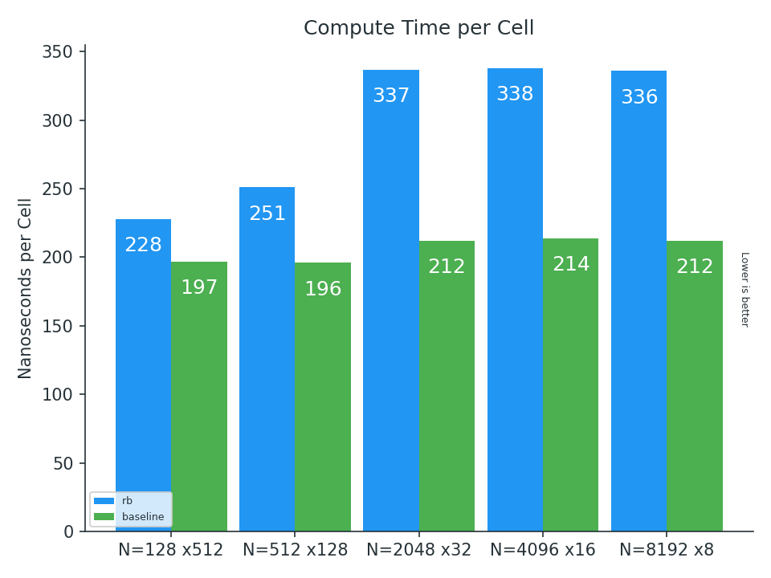
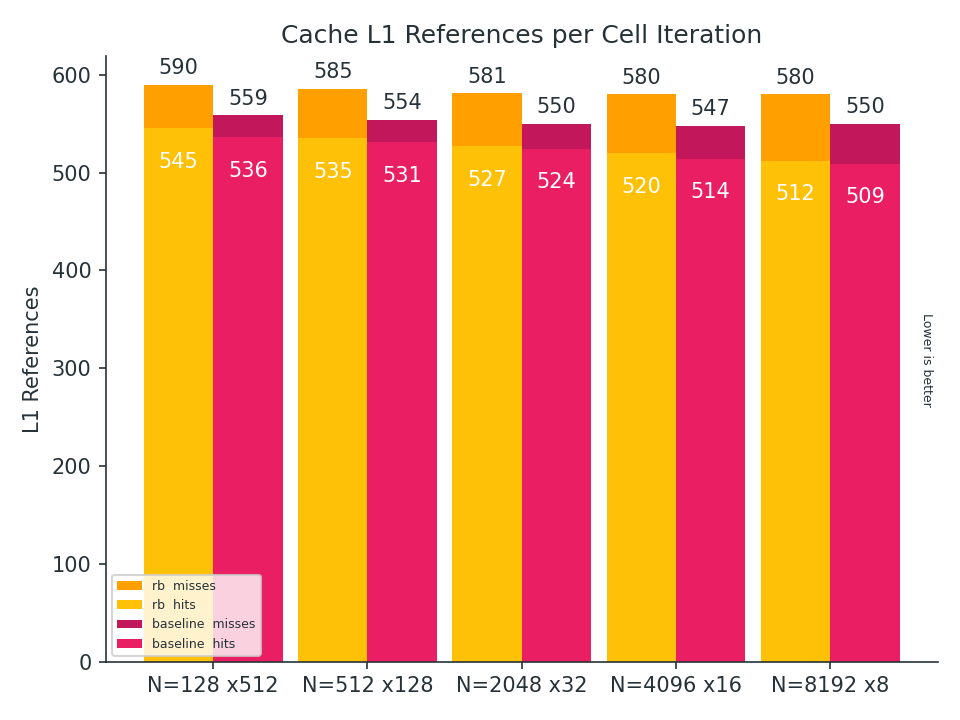
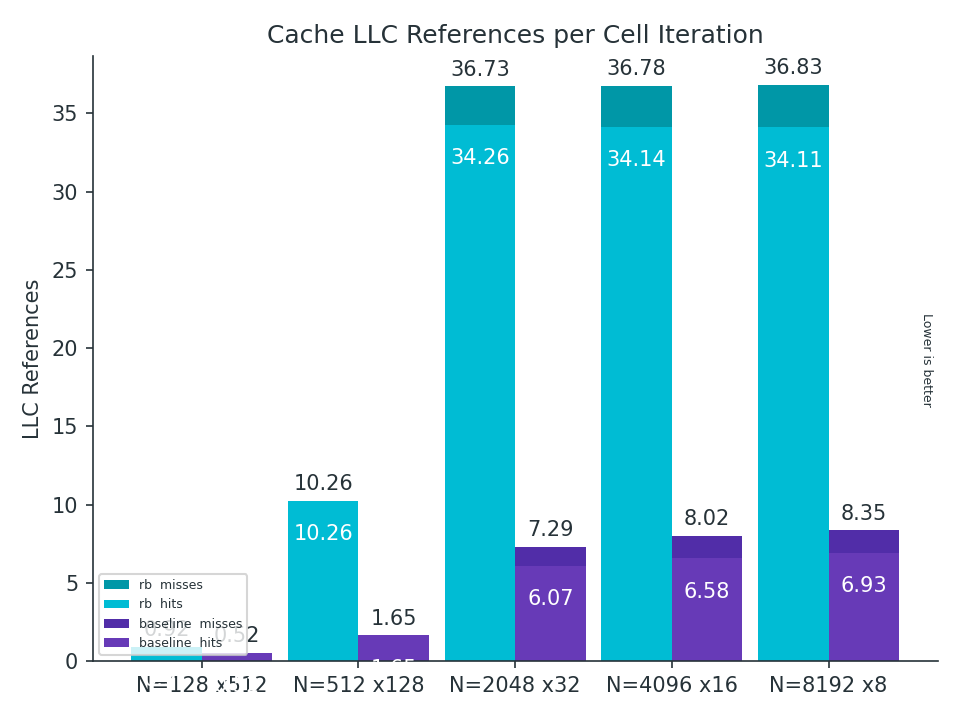

# Lab 1
Recalling to the first laboratory, the maximum perfomance we have got:.
 - N = 128  - steps = 512  - nanoseconds per cell = 221
 - N = 512  - steps = 128  - nanoseconds per cell = 232
 - N = 2048 - steps = 32   - nanoseconds per cell = 268
 - N = 4096 - steps = 16   - nanoseconds per cell = 267
 - N = 8192 - steps = 8    - nanoseconds per cell = 265

# Vectorization
In order to improve the previous numbers and take advantage of SIMD, the entire project was migrated to
the redblack traversal. Similar to a checkerboard, cells are going to be coloured and separated in BLACK
and RED squares. Then, cells will be updated separately by means of its color, 
leading to independent loads and writes. In order to improve the spacial locality and obtain cache friendly
accesses, cells of one color must be stored together.  

### TODO: 

Of course, the code must be re-written to use the red-black traversal and take advantage of its profits.
Therefore, that is what was done first.
Before vectorizing, functions *advect* and *project* were migrated as following. 


---

```c
static void project(unsigned int n, float *u, float *v, float *u0, float *v0) {
  unsigned int color_size = (n + 2) * ((n + 2) / 2);
  float *redu = u;
  float *redv = v;
  float *blku = u + color_size;
  float *blkv = v + color_size;
  float *redu0 = u0;
  float *redv0 = v0;
  float *blku0 = u0 + color_size;
  float *blkv0 = v0 + color_size;
  project_rb_step1(n, RED, redu0, redv0, blku, blkv);
  project_rb_step1(n, BLACK, blku0, blkv0, redu, redv);
  set_bnd(n, NONE, v0);
  set_bnd(n, NONE, u0);
  lin_solve(n, NONE, u0, v0, 1, 4);
  project_rb_step2(n, RED, redu, redv, blku0);
  project_rb_step2(n, BLACK, blku, blkv, redu0);
  set_bnd(n, VERTICAL, u);
  set_bnd(n, HORIZONTAL, v);
}


static void project_rb_step1(unsigned int n, grid_color color,
                             float *restrict sameu0, float *restrict samev0,
                             float *restrict neighu, float *restrict neighv) {
  int shift = color == RED ? 1 : -1;
  unsigned int start = color == RED ? 0 : 1;
  unsigned int width = (n + 2) / 2;
  for (unsigned int i = 1; i <= n; ++i, shift = -shift, start = 1 - start) {
    for (unsigned int j = start; j < width - (1 - start); ++j) {
      int index = idx(j, i, width);
      samev0[index] = -0.5f *
                      (neighu[index - start + 1] - neighu[index - start] +
                       neighv[index + width] - neighv[index - width]) /
                      n;
      sameu0[index] = 0;
    }
  }
}

static void project_rb_step2(unsigned int n, grid_color color,
                             float *restrict sameu, float *restrict samev,
                             float *restrict neighu0) {
  int shift = color == RED ? 1 : -1;
  unsigned int start = color == RED ? 0 : 1;
  unsigned int width = (n + 2) / 2;

  for (unsigned int i = 1; i <= n; ++i, shift = -shift, start = 1 - start) {
    for (unsigned int j = start; j < width - (1 - start); ++j) {
      int index = idx(j, i, width);
      sameu[index] -=
          0.5f * n * (neighu0[index - start + 1] - neighu0[index - start]);
      samev[index] -=
          0.5f * n * (neighu0[index + width] - neighu0[index - width]);
    }
  }
}

```

---

```c

static void advect_rb(grid_color color, unsigned int n, float *samed,
                      const float *d0, const float *sameu, const float *samev,
                      float dt) {
  int i0, j0;
  float x, y, s0, t0, s1, t1;

  int shift = color == RED ? 1 : -1;
  unsigned int start = color == RED ? 0 : 1;
  unsigned int width = (n + 2) / 2;

  float dt0 = dt * n;
  for (unsigned int i = 1; i <= n; i++, shift = -shift, start = 1 - start) {
    for (unsigned int j = start; j < width - (1 - start); j++) {
      int index = idx(j, i, width);
      unsigned int gridi = i;
      unsigned int gridj = 2 * j + shift + start;
      x = gridj - dt0 * sameu[index];
      y = gridi - dt0 * samev[index];
      if (x < 0.5f) {
        x = 0.5f;
      } else if (x > n + 0.5f) {
        x = n + 0.5f;
      }
      if (y < 0.5f) {
        y = 0.5f;
      } else if (y > n + 0.5f) {
        y = n + 0.5f;
      }
      j0 = (int)x;
      i0 = (int)y;
      s1 = x - j0;
      s0 = 1 - s1;
      t1 = y - i0;
      t0 = 1 - t1;

      unsigned int i0j0 = IX(j0, i0);
      unsigned int isblack = (j0 % 2) ^ (i0 % 2);
      unsigned int isred = !isblack;
      unsigned int iseven = (i0 % 2 == 0);
      unsigned int isodd = !iseven;
      unsigned int fstart = ((isred && iseven) || (isblack && isodd));
      int fshift = isred ? 1 : -1;
      unsigned int i1j1 = i0j0 + width + (1 - fstart);
      unsigned int i0j1 = i0j0 + fshift * width * (n + 2) + (1 - fstart);
      unsigned int i1j0 = i0j0 + fshift * width * (n + 2) + width;

      samed[index] = s0 * (t0 * d0[i0j0] + t1 * d0[i1j0]) +
                     s1 * (t0 * d0[i0j1] + t1 * d0[i1j1]);
    }
  }
}

static void advect(unsigned int n, boundary b, float *d, const float *d0,
                   const float *u, const float *v, float dt) {
  unsigned int color_size = (n + 2) * ((n + 2) / 2);

  float *redd = d;
  const float *redu = u;
  const float *redv = v;
  float *blkd = d + color_size;
  const float *blku = u + color_size;
  const float *blkv = v + color_size;
  advect_rb(RED, n, redd, d0, redu, redv, dt);
  advect_rb(BLACK, n, blkd, d0, blku, blkv, dt);
  set_bnd(n, b, d);
}


static void vel_advect_rb(grid_color color, unsigned int n,
                          float *restrict sameu, float *restrict samev,
                          const float *sameu0, const float *samev0,
                          const float *u0, const float *v0, float dt) {
  int i0, j0;
  float x, y, s0, t0, s1, t1;

  int shift = color == RED ? 1 : -1;
  unsigned int start = color == RED ? 0 : 1;
  unsigned int width = (n + 2) / 2;

  float dt0 = dt * n;
  for (unsigned int i = 1; i <= n; i++, shift = -shift, start = 1 - start) {
    for (unsigned int j = start; j < width - (1 - start); j++) {
      int index = idx(j, i, width);
      unsigned int gridi = i;
      unsigned int gridj = 2 * j + shift + start;
      x = gridj - dt0 * sameu0[index];
      y = gridi - dt0 * samev0[index];
      if (x < 0.5f) {
        x = 0.5f;
      } else if (x > n + 0.5f) {
        x = n + 0.5f;
      }
      if (y < 0.5f) {
        y = 0.5f;
      } else if (y > n + 0.5f) {
        y = n + 0.5f;
      }
      j0 = (int)x;
      i0 = (int)y;
      s1 = x - j0;
      s0 = 1 - s1;
      t1 = y - i0;
      t0 = 1 - t1;

      unsigned int i0j0 = IX(j0, i0);
      unsigned int isblack = (j0 % 2) ^ (i0 % 2);
      unsigned int isred = !isblack;
      unsigned int iseven = (i0 % 2 == 0);
      unsigned int isodd = !iseven;
      unsigned int fstart = ((isred && iseven) || (isblack && isodd));
      int fshift = isred ? 1 : -1;
      unsigned int i1j1 = i0j0 + width + (1 - fstart);
      unsigned int i0j1 = i0j0 + fshift * width * (n + 2) + (1 - fstart);
      unsigned int i1j0 = i0j0 + fshift * width * (n + 2) + width;

      sameu[index] = s0 * (t0 * u0[i0j0] + t1 * u0[i1j0]) +
                     s1 * (t0 * u0[i0j1] + t1 * u0[i1j1]);
      samev[index] = s0 * (t0 * v0[i0j0] + t1 * v0[i1j0]) +
                     s1 * (t0 * v0[i0j1] + t1 * v0[i1j1]);
    }
  }
}

static void vel_advect(unsigned int n, float *restrict u, float *restrict v,
                       const float *restrict u0, const float *restrict v0,
                       float dt) {
  unsigned int color_size = (n + 2) * ((n + 2) / 2);
  float *redu = u;
  float *redv = v;
  float *blku = u + color_size;
  float *blkv = v + color_size;
  const float *redu0 = u0;
  const float *redv0 = v0;
  const float *blku0 = u0 + color_size;
  const float *blkv0 = v0 + color_size;
  vel_advect_rb(RED, n, redu, redv, redu0, redv0, u0, v0, dt);
  vel_advect_rb(BLACK, n, blku, blkv, blku0, blkv0, u0, v0, dt);
  set_bnd(n, VERTICAL, u);
  set_bnd(n, HORIZONTAL, v);
}

```

One improvement that we were not awared of in the previous lab, was that the function *advect* is called
twice in order to perform the function *vel_step*. Both of them called with u0 and v0 as parameters.

```c
void vel_step(unsigned int n, float *u, float *v, float *u0, float *v0,
              float visc, float dt) {
  ...

  SWAP(u0, u);
  SWAP(v0, v);
  advect(n, VERTICAL, u, u0, u0, v0, dt);
  advect(n, HORIZONTAL, v, v0, u0, v0, dt);
  ...

}

```

If we got into the definition of advect:

```c

static void advect(unsigned int n, boundary b, float *d, const float *d0,
                   const float *u0, const float *v0, float dt) {
  int i0, i1, j0, j1;
  float x, y, s0, t0, s1, t1;

  float dt0 = dt * n;
  for (unsigned int i = 1; i <= n; i++) {
    for (unsigned int j = 1; j <= n; j++) {
      x = i - dt0 * u0[IX(i, j)];
      y = j - dt0 * v0[IX(i, j)];
      
      ...
      d[IX(i, j)] = s0 * (t0 * d0[IX(i0, j0)] + t1 * d0[IX(i0, j1)]) +
                    s1 * (t0 * d0[IX(i1, j0)] + t1 * d0[IX(i1, j1)]);

```

Here, u0 and v0 will be used to compute **x** and **y** (which will be needed to reach the indexes i0, i1, j0 and j1).
All of these in order to update the array **d** (which will be **u** and **v** as real values in the
vel_step called). If we look at the indexes, they are the same for the update of **u** and **v**.
Therefore,  **x** an **y** will be computed twice!, leading to unnecesary (and expensive) reads and mults. 
So, we decided to implement a version of advect for *vel_step* (which we called *vel_advect*) that updates 
the arrays **u** and **v** in just one call of advect.


The solver.c file with the entire migration to red-black traversal can be found here: 
 - TODO: WRITE A LINK WHERE THE CODE IS HOSTED.

After doing these changes, a comparison with the red-black code given at the beggining of the lab was needed.
In this comparison the new red-black version was called *baseline* on account of our new starting point.







Clearly, there is an improvement not only in the number of ns needed to update a cell but also in the number of cache references
per cell iteration needed. The *rb* needs six times more llcache references than *baseline*. The ratio of cache hits are 
similar, but always avoid referencing to the llcache is better. This improvement is related to the independent updates which
were talked about above. Since cells are stored different in red-black, *rb* updates cell interpersely (which leads to
unfriendly cache accesses). It is algo interesting the *baseline* results resemblance to what was obtained at the end of lab 1.
The comparison is the following:

TODO CREATE ispc_graphs lab1__vs__baseline

# Vectorizing

Up to this point we needed to take different paths, one of us worked with *intrinsics* and the other one with
*ispc*.
Nevertheless, both of us tried take the same approaches in order to compare how much performance we got with different paths.
Before going to the code the profiler told us were to put focus on.

TODO: USE PERF REPORT SCREENSHOT FROM BASELINE .

In this case, perf told us that the greatest gains were in lin_solve. So, both of us tried to vectorize it by means of
what it was teached in the stencil tutorial given in classes.

# 
