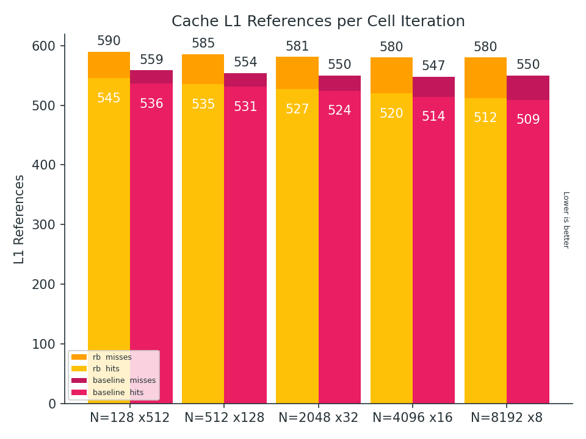
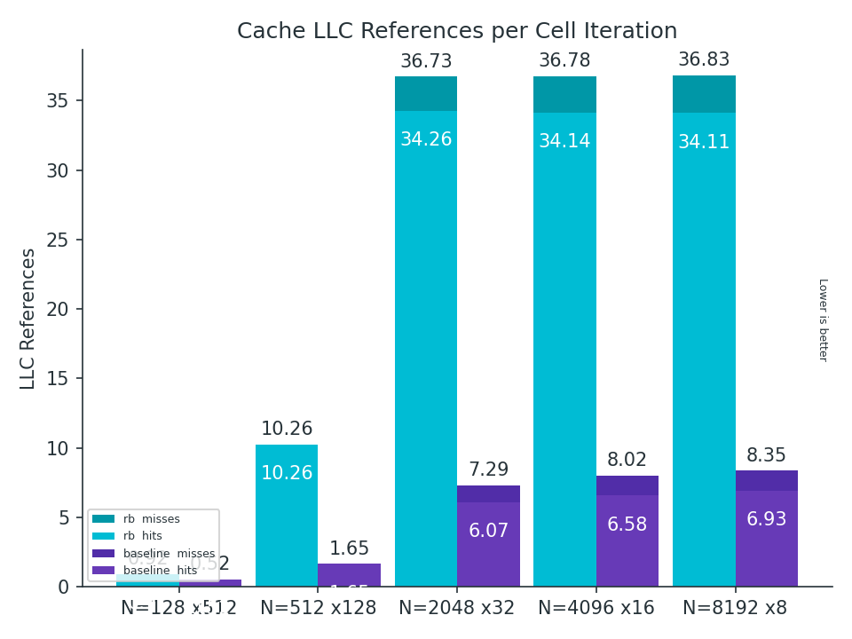

# Lab 1
Recalling to the first laboratory, the maximum perfomance we have got:.
 - N = 128  - steps = 512  - nanoseconds per cell = 221
 - N = 512  - steps = 128  - nanoseconds per cell = 232
 - N = 2048 - steps = 32   - nanoseconds per cell = 268
 - N = 4096 - steps = 16   - nanoseconds per cell = 267
 - N = 8192 - steps = 8    - nanoseconds per cell = 265

# Vectorization
In order to improve the previous numbers and take advantage of SIMD, the entire project was migrated to
the redblack traversal. Similar to a checkerboard, cells are going to be coloured and separated in BLACK
and RED squares. Then, cells will be updated separately by means of its color, 
leading to independent loads and writes. In order to improve the spacial and temporal locality 
cells of one color must be stored together.  

Of course, the code must be re-written in order to use the red-black traversal and take advantage of its profits.
Therefore, that is what was done first.
Before vectorizing, functions *advect* and *project* were migrated as following. 


One improvement that we were not awared of in the previous lab, was that the function *advect* is called
twice in order to perform the function *vel_step*. Both of them called with u0 and v0 as parameters.

```c
void vel_step(unsigned int n, float *u, float *v, float *u0, float *v0,
              float visc, float dt) {
  ...

  SWAP(u0, u);
  SWAP(v0, v);
  advect(n, VERTICAL, u, u0, u0, v0, dt);
  advect(n, HORIZONTAL, v, v0, u0, v0, dt);
  ...

}

```

If we get into the definition of advect:

```c

static void advect(unsigned int n, boundary b, float *d, const float *d0,
                   const float *u0, const float *v0, float dt) {
  int i0, i1, j0, j1;
  float x, y, s0, t0, s1, t1;

  float dt0 = dt * n;
  for (unsigned int i = 1; i <= n; i++) {
    for (unsigned int j = 1; j <= n; j++) {
      x = i - dt0 * u0[IX(i, j)];
      y = j - dt0 * v0[IX(i, j)];
      
      ...
      d[IX(i, j)] = s0 * (t0 * d0[IX(i0, j0)] + t1 * d0[IX(i0, j1)]) +
                    s1 * (t0 * d0[IX(i1, j0)] + t1 * d0[IX(i1, j1)]);

```

Here, u0 and v0 will be used to compute **x** and **y** (which will be needed to reach the indexes i0, i1, j0 and j1).
All of these in order to update the array **d** (which will be **u** and **v** as real values in the
vel_step called). If we look at the indexes, they are the same for the update of **u** and **v**.
Therefore,  **x** an **y** will be computed twice!, leading to unnecesary (and expensive) reads and mults. 
So, we decided to implement a version of advect for *vel_step* (which we called *vel_advect*) that updates 
the arrays **u** and **v** in just one call of advect.


The solver.c file with the entire migration to red-black traversal can be found here: 
 - TODO: WRITE A LINK WHERE THE CODE IS HOSTED.

After doing these changes, a comparison with the red-black code given at the beggining of the lab was needed.
In this comparison the new red-black version was called *baseline* on account of our new starting point.






Clearly, there is an improvement not only in the number of ns needed to update a cell but also in the number of cache references
per cell iteration needed. The *rb* needs six times more llcache references than *baseline*. The ratio of cache hits are 
similar, but always avoid referencing to the llcache is better. This improvement is related to the independent updates which
were talked about above. Since cells are stored different in red-black, *rb* updates cell interpersely (which leads to
unfriendly cache accesses). It is algo interesting the *baseline* results resemblance to what was obtained at the end of lab 1.
The comparison is the following:

TODO CREATE lab1__vs__baseline

## Optimizations

Up to this point we needed to take different paths, one of us worked with *intrinsics* and the other one with
*ispc*.
Nevertheless, both of us tried take the same approaches in order to compare how much performance we got with different paths.

## linsolve

In the case of ISPC it was closely the same, but we applied the vectorization scheme by means of *programCount* which can be a multiple of the vector unit size.

Details of the ispc implementation are as follow:
-  Loop iterators are uniform values. If this is not the case, ispc uses *vmaskmovps* in order to evaluate the loop condition (Which is usually true every iteration).
- How can we avoid the use of masks? Multiples ideas came into our minds. 
One possibility would be the use of cfor, which tells the compiler that the loop condition would be usually true.
Another possibility is stopping at the position *width - programCount + start* and use an if clause to check boundaries (Which will be compiled as just one *vmaskmovps* at the end of updating a row of the grid).
- Anyway, these *vmaskmovps* were not so problematic. Just a few nanoseconds were gained at the expense of readability.

## addsource
In the case of ISPC, the loop peeling was not necessary, we just used a foreach clause over all the grid elements.

# advect

On the other hand, the ispc version of advect was straightforward, there was no necessary of a thorougly debugging as in the case of intrinsics.

Unfortunately there is an issue in the vectorization of both versions. It is the use of gathers because of indexes that were calculated by means of velocity values. Since these accesses would be unpredictable we did not found a way to vectorize advect without this drawback.

## project

the same as intrinsics

## blocks 

the same as intrinsics

## shload

In the case of ISPC, it was slightly different. At the beggining of each row four loads were performed (the four neighbours of a cell). Our goal was to compute four vectors:

  - Up: [index - width, index - width + programCount)
  - Down: [index + width, index + width + programCount)
  - Left: [index - start, index - start + programCount)
  - Right: [index - start + 1, index - start + 1 + programCount)

 The upstears and downstears neighbours are read without change. Then, in order to compute *Left* we read the interval:
 [j * programCount + y * width, 
  j + programCount + y * width): where j = 0, 1, ... 

Then we read the *Next Left*
 [(j + 1) * programCount + y * width, 
  (j + 1) * programCount + y * width)

Finally, using *Left* and *Next Left* we can build *Right* by means of ispc operators.

Since *Next Left* was computed, we do not need to use re-read it again, so it is re-used in the next iteration performing 3 reads instead of 4.
