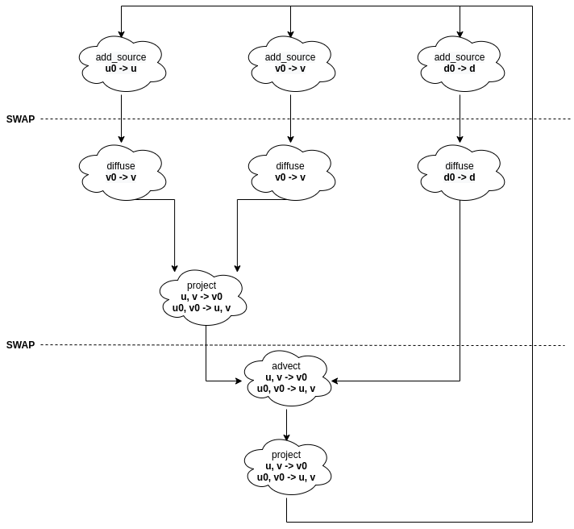
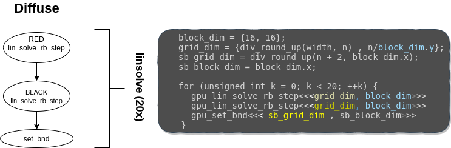
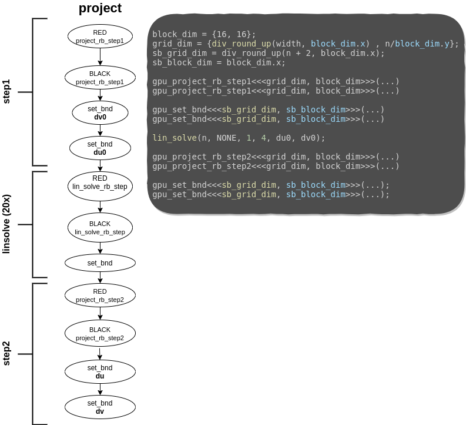
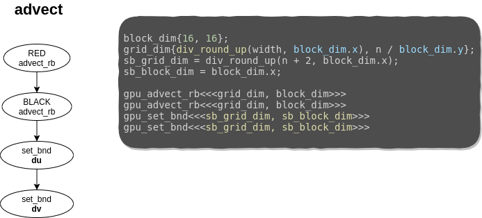
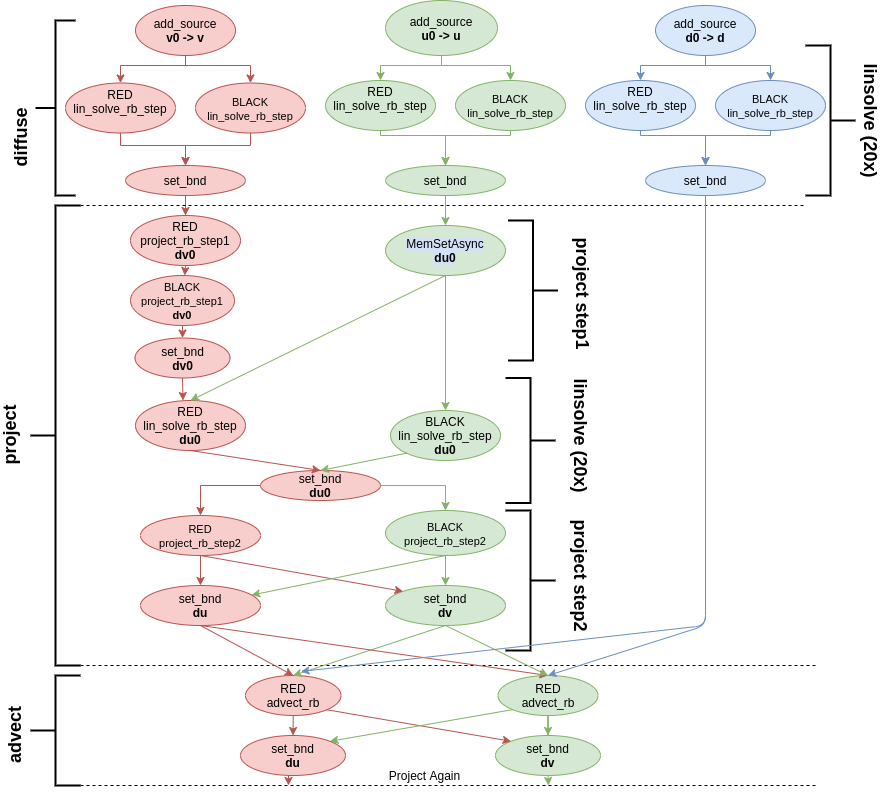

# Parallel Computing - Lab 4: Cuda

- Benjamín Ocampo: nicolasbenjaminocampo@gmail.com
- Mateo de Mayo: mateodemayo@gmail.com

# Migration: from CPU to GPU

Before putting our hands over the work and looking up optimizations, we needed
to migrate all our implementation to Cuda code. It was no so easy due to the
number of lines to be rewritten (more than a 1000 lines of code). Another
obstacle that we had to confront was the CPU-GPU communication. Since their
communication was expensive, minimizing synchronizations between them was
crucial to maintain the simulation at its maximum speed. In order to do so, the
entire program should be launched to the GPU at the beggining. After all the
grid-updates were completed, results were returned to the CPU. We nick named
this process as *fullburst*. That is what we were aiming. There is just one
small detail. Moving everything in a bunch leads to failures, and hours looking
for their bugs. How can we move everything in that way without loosing the
patience?

Remember that the simulation consists of a number of updates or steps, and for
each step, calls to a set of functions.

**Simulation Step**

- *react*
- *step*: <!-- 4 space tab needed for pandoc -->
    - *addsource*
    - *diffuse*
    - *project*
    - *advect*

The migration process consisted in implementing them one by one, and checking if
the simulation keeps well after it. Obviously, since they were developed in an
incremental way, synchronizations with the host were needed. But it was
momentary until the migration was fully-implemented. It might be thought as the
device "asking for help to the host", since it can not handle the rest of the
functions. We also had to take into account which snippet of code should be a
*kernel*. Since one of the easiest way to synchronyze threads in the GPU is
through *kernels*, some dependencies were dealed with them. We are not
mentioning changes of signatures, makefile rules, deletion of omp pragmas,
includes, allocation of device and host data, etc. They were also developed by
means of little changes but were not the core of the migration.

# Versions

## reactburst

During the migration, we dealed with the function *step*, i.e, implement that
procedure in such a way that is executed in the device. This version was called
*reactburst* since step was computed by the GPU, but *react* was still performed
by the CPU (without changes from the lab 3). This is how the execution of step
is:



We had to decide which cloud might be a kernel and which one might be just a
host function that launches other kernels.

### add_source

In this case was straighforward, since *add_source* is not a complex function
and *diffuse* can not start without the previous execution of *add_source*. It
was converted into a kernel.

### diffuse

*diffuse* was splitted in three kernel launches. Two of them were calls to
*lin_solve_rb_step* to compute Gauss-Seidel for RED and BLACK cells. These
kernels had to compute just the half of the simulation matrix so the block and
grid dimensions were chosen in a way that fits better for them. Since *set_bnd*
depens on the previous two kernel calls, a synchronyzation goes between them. So
another different kernel was created for its execution. Note that *set_bnd* is
launched in one dimension with different block and grid dims since it does not
need to update the entire grid.
<!-- TODO: Talk about the choice of block_dim -->



### project

*project* is one of the longest in terms of kernel launches, since it consits of
two parts and an execution of linsolve. As the previous case, they had some
dependencies so project had to be splitted in sub kernels as above.



### advect

After developing the previous two functions. *advect* was not so hard to deal
with. Again the same strategy was used in this case.



### Kernels

Let us cover some of the kernels that are mentioned above. For each kernel, grid
stripe loop was used. It consists in looping over the grids, working with the
global id of each thread related to the current grid that we are working. Here
is a part of the implementation of *gpu_lin_solve_rb_step* and *set_bnd*. The
rest of kernels are similar, if you are interested in their implementation, you
can glace at them at our repository.

```c
__global__
void gpu_lin_solve_rb_step(grid_color color, unsigned int n, float a, float c,
                           const float *__restrict__ same0,
                           const float *__restrict__ neigh,
                           float *__restrict__ same) {
  ... // assignments
  const int grid_width = gridDim.x * blockDim.x;
  const int grid_height = gridDim.y * blockDim.y;
  const int gtidx = blockIdx.x * blockDim.x + threadIdx.x;
  const int gtidy = blockIdx.y * blockDim.y + threadIdx.y;
  for (int y = 1 + gtidy; y <= n; y += grid_height) {
    for (int x = start + gtidx; x < width - (1 - start); x += grid_width) {
      int index = y * width + x;
      same[index] = (same0[index] + a * (
          neigh[index - width] +
          neigh[index - start] +
          neigh[index - start + 1] +
          neigh[index + width]
      )) / c;
    }
  }
}
```

```c
__global__
void gpu_set_bnd(unsigned int n, boundary b, float *x) {
  const int grid_width = gridDim.x * blockDim.x;
  const int gtid = blockIdx.x * blockDim.x + threadIdx.x;
  for (unsigned int i = 1 + gtid; i <= n; i += grid_width) {
    x[IX(0, i)] = b == VERTICAL ? -x[IX(1, i)] : x[IX(1, i)];
    x[IX(n + 1, i)] = b == VERTICAL ? -x[IX(n, i)] : x[IX(n, i)];
    x[IX(i, 0)] = b == HORIZONTAL ? -x[IX(i, 1)] : x[IX(i, 1)];
    x[IX(i, n + 1)] = b == HORIZONTAL ? -x[IX(i, n)] : x[IX(i, n)];
  }
  if(gtid == 0) {
    x[IX(0, 0)] = 0.5f * (x[IX(1, 0)] + x[IX(0, 1)]);
    x[IX(0, n + 1)] = 0.5f * (x[IX(1, n + 1)] + x[IX(0, n)]);
    x[IX(n + 1, 0)] = 0.5f * (x[IX(n, 0)] + x[IX(n + 1, 1)]);
    x[IX(n + 1, n + 1)] = -0.5f * (x[IX(n, n + 1)] + x[IX(n + 1, n)]);
  }
}
```

### Pitfalls

In order to complete one update of the grid, and count one step of the
simulation, both *react* and *step* have to be performed. Since *react* is
computed by the host we can not avoid a synchronization and copies from host to
device at that point. This is what we have in *headless.c* for each simulation
step.

```c

react(hd_prev, hu_prev, hv_prev);
checkCudaErrors(cudaMemcpy(dd_prev, hd_prev, size_in_m,cudaMemcpyHostToDevice));
checkCudaErrors(cudaMemcpy(du_prev, hu_prev, size_in_m, cudaMemcpyHostToDevice));
checkCudaErrors(cudaMemcpy(dv_prev, hv_prev, size_in_m, cudaMemcpyHostToDevice));

step(N, diff, visc, dt,
     dd, du, dv, dd_prev, du_prev, dv_prev,
     from, to);

checkCudaErrors(cudaDeviceSynchronize());
checkCudaErrors(cudaMemcpy(hd_prev, dd_prev, size_in_m, cudaMemcpyDeviceToHost));
checkCudaErrors(cudaMemcpy(hu_prev, du_prev, size_in_m, cudaMemcpyDeviceToHost));
checkCudaErrors(cudaMemcpy(hv_prev, dv_prev, size_in_m, cudaMemcpyDeviceToHost));
```

### Results

<!-- TODO: Put results here -->

## threactburst
Obviously, the bottleneck of *reactburst* is how *react* is computed. So let us
get deep into that function to see what can be done to make it faster.

```c
// Two reductions
for (i = 0; i < size; i++) {
  if (max_velocity2 < uu[i] * uu[i] + vv[i] * vv[i]) {
    max_velocity2 = uu[i] * uu[i] + vv[i] * vv[i];
  }
  if (max_density < d[i]) {
      max_density = d[i];
  }
}
// Memsets
for (i = 0; i < size; i++) {
  uu[i] = vv[i] = d[i] = 0.0f;
}

// Do something with the reductions.
if (max_velocity2 < 0.0000005f) {
  uu[IX(N / 2, N / 2)] = force * 10.0f;
  vv[IX(N / 2, N / 2)] = force * 10.0f;
  for (int y = 64; y < N; y += 64)
    for (int x = 64; x < N; x += 64) {
      uu[IX(x, y)] = force * 1000.0f * (N / 2 - y) / (N / 2);
      vv[IX(x, y)] = force * 1000.0f * (N / 2 - x) / (N / 2);
    }
}
if (max_density < 1.0f) {
  d[IX(N / 2, N / 2)] = source * 10.0f;
  for (int y = 64; y < N; y += 64)
    for (int x = 64; x < N; x += 64) d[IX(x, y)] = source * 1000.0f;
}
```

Here as the comments says we have two reductions needed to compute
*max_velocity2* and *max_density*. Then, the entire matrices *uu*, *vv*, and
*d*, are set to 0, so memsets can be used here. Finally those arrays are updated
so we can tell the GPU to do that for us. Instead of doing the reductions by
hand, we make the most of what *thrust* (a Cuda library) and C++ have to offer.

```c
// Reduction 1
  dfloatp tdd_prev(dd_prev);
  float max_density = *thrust::max_element(tdd_prev, tdd_prev + size);
  // Implicit cudaDeviceSynchronize();
```

```c
// Reduction 2
struct compare_dfloatp2 {
  __device__
  bool operator()(tfloat2 lhs, tfloat2 rhs) {
    float lu = lhs.get<0>();
    float lv = lhs.get<1>();
    float ru = rhs.get<0>();
    float rv = rhs.get<1>();
    return lu * lu + lv * lv < ru * ru + rv * rv;
  }
};

  zip_iterator<dfloatp2> uvs_begin = make_zip_iterator(
    make_tuple(du_prev, dv_prev)
  );
  zip_iterator<dfloatp2> uvs_end = make_zip_iterator(
    make_tuple(du_prev + size, dv_prev + size)
  );
  zip_iterator<dfloatp2> zmaxvel2 = max_element(
    uvs_begin,
    uvs_end,
    compare_dfloatp2()
  );
  // Implicit cudaDeviceSynchronize();
  dfloatp2 mv2 = zmaxvel2.get_iterator_tuple();
  float mvu = *mv2.get<0>();
  float mvv = *mv2.get<1>();
  float max_velocity2 = mvu * mvu + mvv * mvv;
```

```c
  // Memsets and kernel launches
  size_t size_in_mem = size * sizeof(float);
  checkCudaErrors(cudaMemset(du_prev, 0, size_in_mem));
  checkCudaErrors(cudaMemset(dv_prev, 0, size_in_mem));
  checkCudaErrors(cudaMemset(dd_prev, 0, size_in_mem));

  dim3 block_dim{16, 16};
   // The gridblock mapping is one thread per reactionary point
  dim3 grid_dim{
    div_round_up(div_round_up(N, 64), block_dim.x),
    div_round_up(div_round_up(N, 64), block_dim.y)
  };
  if (max_velocity2 < 0.0000005f)
    gpu_react_velocity<<<grid_dim, block_dim>>>(du_prev, dv_prev, force, N);

  if (max_density < 1.0f)
    gpu_react_density<<<grid_dim, block_dim>>>(dd_prev, source, N);
}
```

Note that in this version we are not dealing with how react and step
communicate, so those copies that were shown above are still here in
*threactburst*.

### Results
<!-- TODO: Put here results -->

## stepburst

It is time to make copies between react and step dissapear. In this version, a
bunch of kernels launches are queued up to the thrust synchronization. In order
to do so, move them at the end of the simulation. So everything the memory that
is touched in the program belongs to the device. This can be accomplished since
the GPU works by itself, i.e, react and step use memory that is on the device.
So, the CPU does not do more just launch kernels. If it were not for the thrust
pitfalls this one would be the *fullburst* version that we were aiming for.

```c
for (i = 0; i < steps; i++) one_step();
// Copies are placed at the end
checkCudaErrors(cudaDeviceSynchronize());
checkCudaErrors(cudaMemcpy(hd, dd, size_in_mem,cudaMemcpyDeviceToHost));
checkCudaErrors(cudaMemcpy(hu, du, size_in_mem,cudaMemcpyDeviceToHost));
checkCudaErrors(cudaMemcpy(hv, dv, size_in_mem,cudaMemcpyDeviceToHost));
checkCudaErrors(cudaMemcpy(hd_prev, dd_prev, size_in_mem,cudaMemcpyDeviceToHost));
checkCudaErrors(cudaMemcpy(hu_prev, du_prev, size_in_mem,cudaMemcpyDeviceToHost));
checkCudaErrors(cudaMemcpy(hv_prev, dv_prev, size_in_mem,cudaMemcpyDeviceToHost));
```

### Results

<!-- TODO: Put Results here -->

# Failed Versions

The next versions can be found in their respective branches and were failed
attempts at implementing ideas that in theory should've improved performance but
didn't, or they were negligible, or improved in our some testing gpus (GTX 1060
MaxQ) but not in our target hardware (the RTX 2080 Ti).

## fullburst

We did not want to live with that feeling of "how much performance would have
been obtained if *fullburst* were implemented?" In order to check it, we did a
little test that consisted in erasing the reductions in such a way thrust does
not block the entire burst of launches, but still keeping *react*. In summary we
just commented the following lines:

```c
/*
  zip_iterator<dfloatp2> uvs_begin = make_zip_iterator(
    make_tuple(du_prev, dv_prev)
  );
  zip_iterator<dfloatp2> uvs_end = make_zip_iterator(
    make_tuple(du_prev + size, dv_prev + size)
  );
  zip_iterator<dfloatp2> zmaxvel2 = max_element(
    uvs_begin,
    uvs_end,
    compare_dfloatp2()
  );
  dfloatp2 mv2 = zmaxvel2.get_iterator_tuple();
  float mvu = *mv2.get<0>();
  float mvv = *mv2.get<1>();
  float max_velocity2 = mvu * mvu + mvv * mvv;
*/
  float max_velocity2 = 0.1f;
/*
  dfloatp tdd_prev(dd_prev);
  // TODO: Same as above.
  float max_density = *thrust::max_element(tdd_prev, tdd_prev + size);
*/
  float max_density = 0.1f;
```

Yep, we are cheating a bit, but the result of this trick astonished us, since we
did not increase so much the performance. Why? We uncover that the number of
kernel launches that can be queued is limited to around 1024, so our idea of
launching the entire program and just wait for the result is not possible.
Fortunately, we discover it before implementing it. Imagine the amount of time
that we have lost if we inmersed ourselves to accomplish this "optimization". We
had already seen that cub allows reductions without blocking so that implies
that react had to be implemented again.

## streamburst

Another idea was the use of streams in the code and maximize the concurrency.
Nevertheless we did not get wildly deep into it since streams require more than
a few changes in the code. What we learn after 3 laboratories is to test an idea
before losing hours on a chair in front of a screen with implementations that
are not goint to be fruitful. The idea was to assign one stream to each kernel
launch and see what happens. Something like:

```c
static cudaStream_t streams[32768];
static cudaStream_t get_new_stream() {
  static int i = 0;
  cudaStreamCreate(&streams[i]);
  i++;
  return streams[i - 1];
}

...

kernel<<< ..., ..., get_new_stream()>>>

```

After changing adding streams, results were oscillating between 2 and 3 ns per
cell. They were not better but also not worse. So we were not sure about how
much performance might be obtained with streams. Maybe there is an overhead if a
new stream is created for each kernel launch.

## graphburst

After doing that experiment we decide to tackle an implementation with streams
but also using cuda graphs. So first we needed to analyze where the dependencies
were placed in order to assign properly job/kernels for them. Looking at the
graph we traced in reactburst, we can expand it to see kernel dependencies and
find which kernel launches can be executed with other one.



As we can see in the graph, we divided the work in three streams. It might look
the work is unbalanced, but consider that streams increase concurrency using
resources that other kernels do not use completely. We also wanted to use cuda
graphs, capturing it by means of *streamCapture* cuda directives. Since one of
the conditions of these technique is to have a *main stream*, we selected the
red one to command over the others.

The implementation was not so straightforward as the graph looks like, but we
could do it in such a way that there are no so much changes of the *stepburst*
version. At the beggining of the program, events and streams were created and
then one call to step was performed enclosed by *cudaStreamBeginCapture* and
*cudaStreamEndCapture*. After it, it returned an instance of graph is created
and finally launched.

```c
cudaGraph_t graph;
create_stream_events();
checkCudaErrors(cudaStreamBeginCapture(stream0,cudaStreamCaptureModeGlobal));
step(
  N, diff, visc, dt,
  dd, du, dv, dd_prev, du_prev, dv_prev,
  stream0, stream1, stream2,
  spread, join_stream0, join_stream1, join_stream2
);
checkCudaErrors(cudaStreamEndCapture(stream0, &graph));
checkCudaErrors(cudaGraphInstantiate(&step_graph, graph, NULL,NULL, 0));
cudaGraphDestroy(graph);
```

```c
one_step(...){
  react(...);
  checkCudaErrors(cudaGraphLaunch(step_graph, stream0));
  ...
}
```

Unfortunately it seems that using streams and cuda graphs was not the key of the
problem since we could not get improvements. In order to see if streams were
actually used we check it with nvvp that show us a thorougly execution of the
program. Here we could obtain that *gpu_lin_solve_rb_step* is the 85% of the
code, and the rest is taken by the other kernels. Maybe we could get some
concurrency between kernels but they were not the key of the problem.

## onekernel

One of our main concerns was the cache not being properly utilized as each
lin_solve kernel launch erases any cache the previous blocks may have fetched,
and by the nature of the problem, this would imply to re-read twenty times from
global memory.

To prevent this, in recent versions of CUDA the feature of Cooperative Groups
(CG) was introduced. This are groups of threads that can be smaller than a warp,
bigger than an SM covering an entire device worth of threads and even bigger
than a device extending over multiple devices. CG offer lots of possibilities
that are discussed more in depth in [this
article](https://developer.nvidia.com/blog/cooperative-groups/) but for our
particular case, what we needed was a way to synchronize the entire device
between `gpu_lin_solve_rb_step` launches, and the cooperative groups `.sync()`
method does exactly that. So in this way we could make `gpu_lin_solve` to be a
single kernel that iteratively and in a synchronized manner, calls
`gpu_lin_solve_rb_step` device functions and syncs them with `grid.sync()` as
follows:

```c
__device__ gpu_lin_solve_rb_step(...);
__global__ gpu_lin_solve(...) {
  for (int k = 0; k < 20; k++) {
    gpu_lin_solve_rb_step(RED, ...);
    gpu_lin_solve_rb_step(BLACK, ...);
    grid.sync();
  }
}
```

Unfortunately it seems that the [grid synchronization
feature](https://docs.nvidia.com/cuda/cuda-c-programming-guide/index.html#grid-synchronization-cg)
of the CG is not very optimized in hardware yet (at least up to turing), and
unfortunately we saw a decrease in performance (from ~2.5 to ~3.5 with N=4096).

Some points that we need to mention that appeared during this implementation
were:

- Not syncing: Removing the `grid.sync()` call above makes the simulation a
  little weird, however it could be still a pretty reasonable approximation for
  some use cases, and the performance increases significantly (from ~2.5 to ~1.6
  with N=4096).
- Occupancy API: For using the grid sync feature of CGs we need to use special
  ways of launching kernels and defining their dimensions. In particular the
  number of blocks must match those of the amount of SMs in the device, and the
  number of threads in a block must be calculated with the some of the Occupancy
  API methods.
- Cache Preference: In this example we ought to use the
  `cudaDeviceSetCacheConfig` function which allows us to hint to the device that
  we prefer Cache L1 over shared memory as we are not using none of the latter.
  However in all of our tests in this and other implementations it seems that
  the device is smart enough to tell which setting to use as the performance
  doesn't improve.

### stepburst-shmem

A lot of places talked wonders about the usage of shared memory even in trivial
[examples](https://developer.nvidia.com/blog/using-shared-memory-cuda-cc/) where
the cache L1 should work perfectly fine so we decided to give it a try.

```c
__device__
void gpu_lin_solve_rb_step(...) {
  __shared__ float neigh_cache[BLOCK_WIDTH + 2][BLOCK_HEIGHT + 1];
  ... // load neighbours to cache
  __syncthreads();
  same[...] = ... // something related to same0 and neigh_cache but not neigh
}
```

Later on we profiled with `nvcc -m global_hit_rate` and discovered a hit rate of
40%. With this and by commenting and discommenting reads, we tracked down the
following pattern of cache usage (or at least our hypothesis for it):

| Access | Referenced from |
| --- | --- | --- |
| same | write miss? |
| same0 | miss |
| neigh up | hit |
| neigh down | hit |
| neigh left | miss |
| neigh right | vectorized |

So this explains our 40% (2/5) accesses as one of them is vectorized. Then we
did an experiment and not a full implementation of the same idea but putting
same0 in shared as it would've been easier for not having to deal with the
neighbours halo, but still it did not give gains.

### onekernel-shmem

As in this version we have exactly one block per SM per the CG requirements, the
idea is to fill the shared memory of each block with a portion of its sub grid
and use shared memory when the grid strid loop needs to use memory that is
cached there. Unfortunately in our tests the with and without the added
conditional were in all cases worst than stepburst. The grid synchronization was
still a heavy hit on performance.

### stepburst-occupancy

We brought the idea of using the occupancy api from the onekernel implementation
with the hopes that by dividing the problem to match exactly the hardware it may
improve the performance, but the opposite happened. It seems that dividing the
problem in weird partitions (in this cases divided by 68 as the RTX 2080 ti has
68 SMs) is probably subutilizing the vector units.

### stepburst-roae

As we were running out of good ideas, we implemented all of our bad ones in
here, the "Root Of All Evil" branch, which applies and discuss lots of minimal
and mostly superficial optimizations, which are as follows:

- `cudaDeviceSetCacheConfig`: Hint for increased cache usage as we couldn't use
  shared memory
- Vector loads: `float4`, `int4`, and similar types are supposed to increase a
  bit [the overall
  bandwidth](https://developer.nvidia.com/blog/cuda-pro-tip-increase-performance-with-vectorized-memory-access/)
  but for using them we needed to make aligned reads and our memory layout did
  not allow that.
- `#pragma loop unroll`: For unrolling loops.
- `nvcc` flags: basically `-use_fast_math` and
  [friends](https://docs.nvidia.com/cuda/cuda-c-best-practices-guide/index.html#nvcc-compiler-switches).
- Block/grid dims: There were many settings which gave good results, we decided
  to go with 8x8 as 64 is the amount of cuda cores in one SM for the 2080 Ti.
- PTX intrinsics: There are many intrinsics for math (which were already enabled
  by the nvcc flags) and for memory load/store, we tried using a similar
  technique as to the `stream` technique we used in lab2 with `__stwt` but it
  didn't give any gains, probably CUDA was already figuring that out. Also the
  `__ldg` intrinsic which hints that a load should be cached in a read-only
  faster cache, it improved about 2% the performance in our pascal GTX 1060 MaxQ
  but nothing on the target RTX 2080 Ti.

### stepburst-shidden

So this was the hacky idea. We read in some places that the shared memory even
though in theory it has the same lifetime of a block, in practice the driver
does not clean shared memory between calls and just sets it unused. So the idea
is that we can reuse between kernel launches this "undefined" shared memory with
some tricks which we implemented as follows:

```c
void lin_solve(...) {
  gpu_lin_solve_rb_step_shtore(RED);
  gpu_lin_solve_rb_step_shtore(BLACK);
  for (int k = 0; k < 19; k++) {
    gpu_lin_solve_rb_step_shload(RED);
    gpu_lin_solve_rb_step_shload(BLACK);
  }
}

__global__
void gpu_lin_solve_rb_step_shtore(...) {
  __shared__ float csame0[BLOCK_HEIGHT][BLOCK_WIDTH];
  __shared__ int bx, by, id1, id2;

  // Save block information for later discovery
  if (first thread of block) {
    bx = blockIdx.x; by = blockIdx.y;
    id1 = bx * by + bx; id2 = bx * by + by;
  }

  // Save appropiaty value of same0 for next kernels
  const float previous = same0[index];
  csame0[threadIdx.y][threadIdx.x] = previous;

  ... // Get lots of "set but not used" compiler warnings

  ... // regular lin_solve_rb_step using previous instead of same0

}

__global__
void gpu_lin_solve_rb_step_shload(...) {
  __shared__ float csame0[BLOCK_HEIGHT][BLOCK_WIDTH];
  __shared__ int bx, by, id1, id2;

  float previous;
  // Notice most of these variables are undefined
  if (id1 == bx * by + bx && id2 == bx * by + by) {
    // Found'em! read "undefined" memory.
    previous = csame0[threadIdx.y][threadIdx.x];
  } else {
    // Read from global memory
    previous = same0[index]; // (*) There is a catch here, explained in a moment
  }

  ... // Regular lin_solve_rb_step but using bx and by as block indexes instead
}
```

Notice in the conditional from `_shload` we check that our undefined shared
memory effectively has the correct values, one could ask about the ratio in
which this check effectively "finds" what it is looking for, here are the
results:

| GPU | $N \leq 64$ | $N = 512$ | $N = 2048$ |
| --- | --- | --- | --- |
| GTX 1060 MaxQ | 100% | 50% | 50% |
| RTX 2080 Ti | 100% | 25% | 2.21% |

So from one side, it seems that the new turing architecture does something with
undefined shared memory that makes it not as reliable as in pascal. In pascal
however that 50% means literally half of the reads to same0 in the twenty
iterations could be avoided.

(*) Another thing to take into consideration is the `else` in the code above is
figurative and does not solve all of our problems to make the algorithm correct.
In particular, when we don't find a hit, we can't just keep computing as usual,
because our sub grid could've been already computed by another block which found
the corresponding shared memory. And as such we would need to divide into two
steps the solver, first filling all the found-in-undefined-shared-memory sub
grids, and then all the rest which were not cached.

So because of that implementation complication and the fact that in turing, our
target architecture, would not make a notorious difference, we decided not to
finish implementing the idea.
